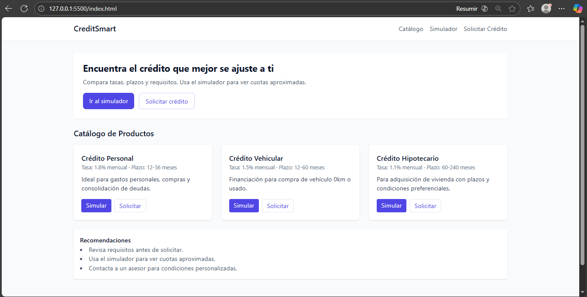
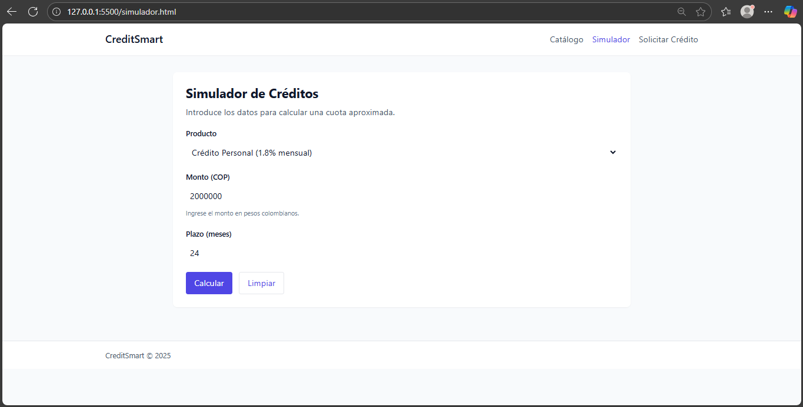
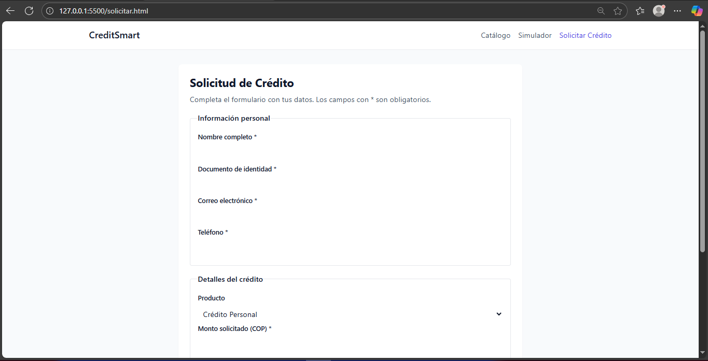

# CreditSmart - Proyecto EA1 Diseño de Interfaces Web

**Estudiante:** Brayan Palacio Carreazo  
**Descripción:** Proyecto de ejemplo que implementa 3 páginas responsive utilizando HTML5 y CSS3 **Framework:** Tailwind CSS (CDN para demo/entrega)

## Estructura de archivos
```
credit_smart_repo/
├─ index.html         # Página principal - Catálogo
├─ simulador.html     # Página de búsqueda / simulador
├─ solicitar.html     # Página de formulario
├─ styles.css         # Estilos compartidos
└─ README.md
```

## Ejecutar el proyecto
1. Descargar o clonar el repositorio.
2. Abrir `index.html` en tu navegador (no requiere servidor).
3. Probar navegación entre `index.html`, `simulador.html` y `solicitar.html`.

## 📸 Capturas de Pantalla

### Página principal (Catálogo)


### Simulador de Crédito


### Formulario Solicitar Crédito


## Notas sobre desarrollo y commits
Se recomiendan al menos 5 commits descriptivos durante el desarrollo:

- `Estructura HTML de página principal`
- `Estilos de tarjetas de crédito`
- `Formulario de solicitud completo`
- `Simulador de cuotas implementado`
- `Diseño responsive y correcciones finales`

## Fuentes y referencias
- Este código es original con fines educativos. Si se utiliza código de terceros, citar en comentarios del archivo correspondiente.
